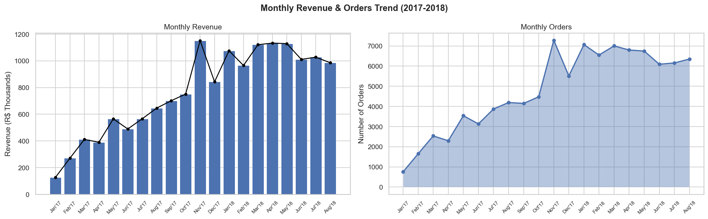
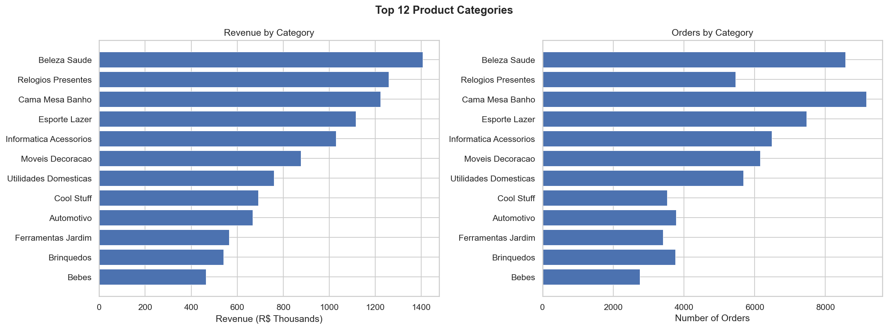
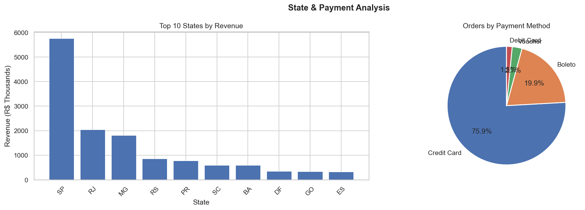
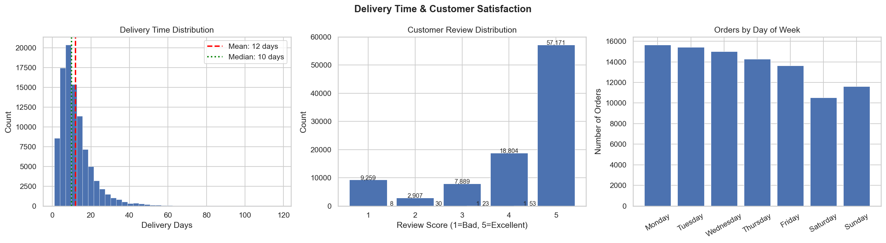
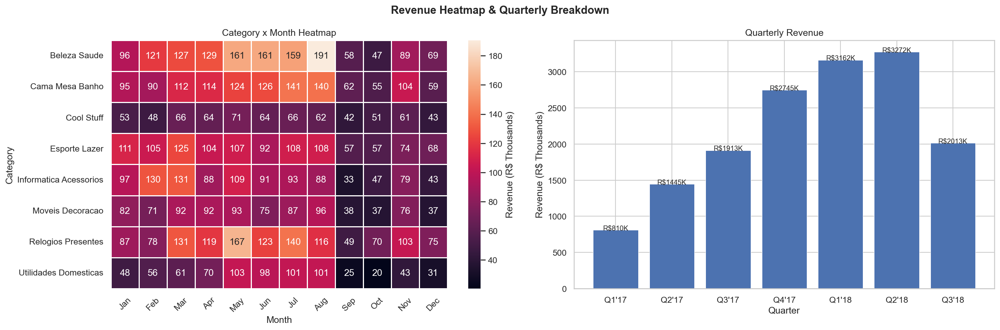
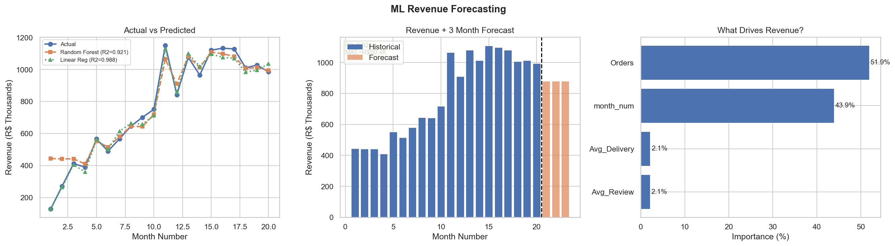

# E-Commerce Sales Intelligence Analysis


## Overview
Analysis of **100,000+ real e-commerce orders** from **Olist** — 
Brazil's largest online marketplace.

Performed complete EDA, data cleaning, visualizations, 
and built an ML forecasting model using Python.

---

## Key Results

| Metric | Value |
|--------|-------|
| Total Revenue | R$ 15.3 Million |
| Total Orders | 96,000+ |
| Top Category | Beauty & Health |
| Top State | São Paulo |
| Avg Delivery Time | 12 days |
| Customer Rating | 4.16 / 5.0 |
| ML Model R2 Score | **0.921** |

---

## Project Charts

### Monthly Revenue Trend


### Top Product Categories


### State & Payment Analysis


### Delivery & Customer Reviews


### Revenue Heatmap


### ML Sales Forecasting


---

## What I Did

- Loaded and cleaned **7 real CSV files** from Olist dataset
- Merged multiple tables using Pandas (like SQL JOIN)
- Performed full **Exploratory Data Analysis (EDA)**
- Created **6 professional visualizations**
- Built **Random Forest ML model** to forecast revenue
- Achieved **R2 Score of 0.921** (92.1% accuracy)
- Forecasted next 3 months of revenue

---

## Tools & Technologies

| Tool | Purpose |
|------|---------|
| Python | Core programming language |
| Pandas | Data manipulation & cleaning |
| NumPy | Numerical computing |
| Matplotlib | Data visualization |
| Seaborn | Advanced visualizations |
| Sklearn | Machine learning model |
| Jupyter Notebook | Development environment |

---

## Dataset

- **Name:** Olist Brazilian E-Commerce Dataset
- **Source:** [Kaggle](https://www.kaggle.com/datasets/olistbr/brazilian-ecommerce)
- **Size:** 100,000+ real orders
- **Files:** 7 CSV files merged together

---

## Business Insights Found

1. **Beauty & Health** is the top revenue generating category
2. **São Paulo** state contributes highest sales
3. **Credit Card** is most preferred payment method
4. Average delivery time is **12 days** — improvement needed
5. Customer satisfaction is **4.16/5.0** — generally positive
6. Revenue showed **consistent growth** from 2017 to 2018

---

## How to Run
```bash
# Clone repository
git clone https://github.com/mohamedarsath1379/ecommerce-sales-analysis.git

# Install libraries
pip install -r requirements.txt

# Open notebook
jupyter notebook ecommerce_default.ipynb
```

---

## Author

**Mohamed Arsath A**
B.Tech Artificial Intelligence & Data Science

- LinkedIn: [Mohamed Arsath A](https://www.linkedin.com/in/mohamedarsath007)
- GitHub: [mohamedarsath1379](https://github.com/mohamedarsath1379)

---

*Open to Data Analyst & ML Engineer opportunities!*
